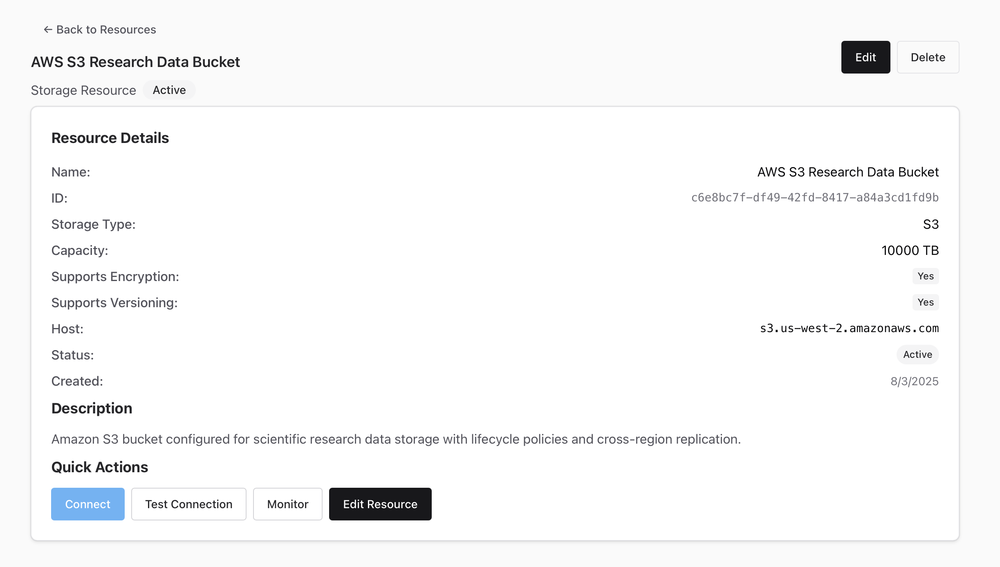

## **GSoC Project Report: Modernizing the Apache Airavata Admin Portal**

**Author:** Krish Katariya \
**Organization:** The Apache Software Foundation (_Sub Organization_: Apache Airavata) \
**Project Size:** Small

#### **1. Introduction**

As part of the broader effort to modernize Apache Airavata, this project's primary goal was to replace the legacy Django-based admin portal whose function includes critical administrative tasks such as managing compute resources, storage resources, and users. The objective is to migrate this functionality of managing resources into a more modern and maintainable technology stack than what we currently have, starting with a new React-based user interface. The report I have written below details the progress made over the last few months of GSOC, including UI development, a deep dive into the technical challenges of backend integration, and the pivot we are currently making to a new service architecture.

---

#### **2. Phase I: User Interface Development**

The project's initial phase focused on building out the user interface within the `airavata-research-portal` repository. Working with my peers on UI/UX designs, I implemented a wide range of new components and pages using the **Chakra UI v3** library.

Originally, the goal was to replicate previous UI designs into the new `airavata-research-portal`, which I was able to implement successfully. However after building out these UI components, in discussions with the airavata community, we decided it made more sense to adapt the UI to follow a new paradigm in which administrative tasks such as managing compute resources and storage resources became the responsibility of the users, rather than admins who would have to manually add in new compute and storage resources. Based on this, we pivoted into a new UI design which prioritized users. From here, a third redesign of the UI followed to improve on the overall user experience. Over the course of GSOC, I built three different Chakra v3 React UIs, each building on the old one and improving in the UI/UX designs over time. 

Some of my accomplishments in this phase include:
* **New Research Catalogue:** Added a comprehensive research catalogue page, providing new views for managing **models, repositories, datasets, and notebooks**.
* **Resource Management UI:** User interfaces were also built for adding new items such as **compute and storage resources**, as well as for initiating new user sessions.

**Note**: At this point, the UI's had been using mock data, and the next phase includes the integration of real time data.

##### UI v1 (Django Replication)

  

  

  

  

##### UI v2 (Replicated the Design In React, code overwritten by v3 UI)

  

##### UI v3 (Final Design UI Implemented in React)

  

  

  

  

  

  

  

---

#### **3. Phase II: Backend Integration and Technical Investigation**

The second phase aimed to replace the UI's mock data with live data from the backend by connecting to the **Apache Thrift API**. Unlike a traditional REST API, Thrift requires a code-generation step using a compile, and while trying to integrate the react portal with this code-generation step, I found several significant technical hurdles that highlighted the overall friction between our current Thrift architecture and modern web development frameworks. 

* **Challenge 1: Compiler and Module Incompatibility:** Our **Vite-based** React application requires **ES Modules (ESM)** for its JavaScript modules. The issue with this is that the official Thrift compiler, having not received significant updates in this area, generates code using the older **CommonJS** format. This makes it incompatible with our modern Vite/React toolchain out-of-the-box.
    * **Solution:** After a lot of research, I located a specific commit on the Thrift source repository. By building the compiler from this exact source, I was able to generate ESM-compatible TypeScript code. The resulting code was generally functional, though occasionally "iffy," and required careful handling.

* **Challenge 2: Browser vs. Server-Side JavaScript:** The generated Thrift client code was also designed for a server-side Node.js environment and depended on core Node APIs that are usually not present in web browsers.
    * **Solution:** While manually modifying the auto-generated code was an option, it was pretty impractical and highlighted a bigger issue that we needed to solve down the line anyways. As a temporary measure, I implemented several **browser polyfills**. These polyfills successfully bridged the environmental gap, allowing the server-centric code to execute in the browser.

* **Debugging Step - Local Test Server:** At this point, I was still unable to get proper connection with the server through my react portal, and so to verify the generated client code and the polyfills, I built a local Thrift test server in Python. I was able to build up a fully functional version of the portal that successfully communicated with this local server. This was important because it proved that the client-side code was correct, meaning the remaining issues to the connection was with the main production server.

* **Challenge 3: Network Protocol Mismatch:** The last blocker explaining the issues from above was the network protocol. The existing Airavata Thrift server communicates using the binary **`TSocket`** protocol, which worked well in its original PHP environment. However, for security reasons, web browsers are limited to making requests via **HTTP** and **WebSockets**, which leads to an incompatibility making direct connection from the browser-based React app to the `TSocket` service impossible.

---

#### **4. Phase III: Future Direction, Architectural Pivot, and Current Work**

The investigation in Phase II made it clear that a new backend strategy was required due to the legacy Thrift API's protocol and design flaws, or the server would have to be adapted to run on HTTP. Based on this and discussions with the community, I began design and development on a new, standalone API: the `admin-api-server`. The idea was that this API would provide a modern, RESTful endpoints API specifically for managing compute and storage resources, which could then be adapted over time to take up more responsibilities from the airavata-api. The benefit to this is that the API could be built with the user-based paradigm mentioned before in mind. 

However, as this work progressed, we decided it was better to add a version 2 to the `research-service` API. This was a second, also complex architectural pivot which introduced more engineering because the architecture and code that had been designed for the standalone `admin-api-server` could not just be copied over. 

This translation effort is the core of my current work and involves several complexities:
* **Architectural Patterns:** The design patterns and assumptions of the new `admin-api-server` had to be adapted to the established conventions and patterns already present in the `research-service`.
* **Integrating Data Models:** The new data models for compute and storage resources had to be integrated with the `airavata-api` which has its own issues due to OpenJPA versioning issues.

If you are more interested in the specific implementation details in the v2 API, feel free to take a look at the v2 API PR (linked below)!

---

#### **5. In Progress PRs**
These are the PRs in place. Since a new API is also very exploratory work, there are still ongoing discussions about architectural decisions before these get merged. Feel free to leave feedback!
* [v2 API](https://github.com/apache/airavata/pull/549)
* [Updated Portal to support v2 API](https://github.com/apache/airavata-portals/pull/25)
---

#### **6. Supporting Code Artifacts**

For reference, the code for the exploratory work mentioned in this report can be found at the following locations. These artifacts are provided as a record of the investigation process.

* **`admin-api-server` (Standalone POC):** [Link](https://github.com/katamyra/Krish-GSOC-2025/tree/main/admin-api-server)
* **Local Thrift Test Server:** [Link](https://github.com/katamyra/Krish-GSOC-2025/tree/main/ThriftServer)

---

#### **7. Community Communication and Collaboration**

Communication happened throughout GSoC through several ways:
* **Regular Meeting Progress Updates:** I provided consistent updates on development progress weekly during meetings, showing current work done and future steps. 
  * **Architectural Discussions and Consensus Building:** When significant technical roadblocks were encountered with the Thrift integration, they were discussed in these meetings.
* **Posting Updates to the Airavata Mailing List**
  * https://lists.apache.org/thread/ltqzq7222po3v95z81dk5cw71o5v33ko
  * https://lists.apache.org/thread/bw29685h64xry823l2cx5h579m0yyqw8
  * https://lists.apache.org/thread/lo6g0hvvmps27xpncjxvlptbfq21xlf4
  * https://lists.apache.org/thread/ofl0ncypvfldzyjk971c0l3vpzo75dv4

---

#### **8. Reflections and Conclusions**

For me, I realized that this project has been a valuable lesson in the iterative nature of software architecture. While a significant amount of work on the Thrift client integration and the initial `admin-api-server` will not be merged upstream directly, I am still glad I did it for my own learning, and this exploratory work was necessary to do at some point to reach the best architectural decisions. 

As development of this new API proceeds, community feedback is invaluable! Any **recommendations or input** regarding technical requirements, design patterns, or desired features would be greatly appreciated. Thanks for reading!
