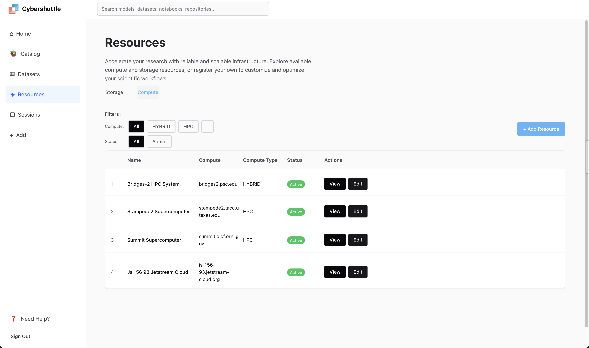

### **GSoC Project Report: Modernizing the Apache Airavata Admin Portal**

**Author:** Krish Katariya \
**Organization:** The Apache Software Foundation (_Sub Organization_: Apache Airavata) \
**Project Size:** Small

#### **1. Introduction**

As part of the broader effort to modernize Apache Airavata, this project's primary goal was to replace the legacy Django-based admin portal whose function includes critical administrative tasks such as managing compute resources, storage resources, and users. The objective is to migrate this functionality into a modern, robust, and maintainable technology stack, beginning with a new React-based user interface. The report I have written below details the progress made over the last few months of GSOC, including UI development, a deep dive into the technical challenges of backend integration, and the strategic pivot we have made to a new service architecture.

---

#### **2. Phase I: User Interface Development**

The project's initial phase focused on building out the user interface within the existing `airavata-research-portal` repository. Working with my peers on UI/UX designs, I implemented a wide range of new components and pages using the **Chakra UI v3** library.

Originally, the goal was to replicate previous UI designs into the new `airavata-research-portal`, which I was able to implement succesfully. However after building out these UI components, in discussions with the airavata community, we decided it made more sense to adapt the UI to follow a new paradigm in which administrative tasks such as managing compute resources and storage resources fell into the hands of the users, rather than admins who would have to manually add in new compute and storage resources. Based on this, we pivoted into a new UI design which prioritized users. Here are some examples of UI designs and implemented UIs. From here, a third redesign of the UI followed to improve on the overall user experience. Over the course of GSOC, I built three different Chakra v3 React UIs, each building on the old one and improving in the UI/UX designs over time. 

Key accomplishments in this phase include:
* **New Research Catalogue:** A significant addition was a comprehensive research catalogue page, providing new views for managing **models, repositories, datasets, and notebooks**.
* **Resource Management UI:** Interfaces were built for adding new items such as **compute and storage resources**, as well as for initiating new user sessions.
* **Integration-Ready Development:** All UI development was performed in a dedicated fork of the repository to ensure that the new code can be cleanly integrated into the main project via a pull request at the appropriate time. The UI was built against mock data to facilitate rapid and independent development.

**Note**: At this point, the UI's had been using mock data, and the next phase includes integration of real time data.

##### UI v1 (Django Replication)

  

  

  

  

##### UI v2 (Replicated the Design In React, code overwritten by v3 UI)

  

##### UI v3 (Final Design UI Implemented in React)

  

  

  

  

  

  

  

##### UI v2 (First Redesign) 
---

#### **3. Phase II: Backend Integration and Technical Investigation**

The second phase aimed to replace the UI's mock data with live data from the backend by connecting to the **Apache Thrift API**. Unlike a traditional REST API, Thrift requires a code-generation step using a compiler. This process revealed several significant technical hurdles that highlighted the friction between legacy Thrift architecture and modern web development practices.

* **Challenge 1: Compiler and Module Incompatibility:** Our **Vite-based** React application requires **ES Modules (ESM)** for its JavaScript modules. The official Thrift compiler, having not received significant updates in this area, generates code using the older **CommonJS** format. This makes it incompatible with our modern toolchain out-of-the-box.
    * **Solution:** After extensive research, I located a specific, unreleased commit on the Thrift source repository. By building the compiler from this exact source, I was able to generate ESM-compatible TypeScript code. The resulting code was generally functional, though occasionally "iffy," and required careful handling.

* **Challenge 2: Browser vs. Server-Side JavaScript:** The generated Thrift client code was designed for a server-side Node.js environment and depended on core Node APIs not present in web browsers.
    * **Solution:** While manually modifying the auto-generated code was an option, it was deemed impractical and unmaintainable. The more realistic approach was to implement several **browser polyfills**. These polyfills successfully bridged the environmental gap, allowing the server-centric code to execute in the browser.

* **Debugging Step - Local Test Server:** To verify the generated client code and the polyfills, I built a local Thrift test server. I was able to stand up a fully functional version of the portal that successfully communicated with this local server. This crucial step proved that the client-side code was correct, isolating the remaining issues to the connection with the main production server.

* **Challenge 3: Insurmountable Network Protocol Mismatch:** The final and most critical blocker was the network protocol. The existing Airavata Thrift server communicates using the binary **`TSocket`** protocol, which worked well in its original PHP environment. However, for security reasons, web browsers are strictly limited to making requests via **HTTP** and **WebSockets**. This fundamental protocol incompatibility makes a direct connection from the browser-based React app to the `TSocket` service impossible.

---

#### **4. Phase III: Future Direction, Architectural Pivot, and Current Work**

The investigation in Phase II made it clear that a new backend strategy was required due to the legacy Thrift API's protocol and design flaws. The initial strategic response was to design and begin development on a new, standalone microservice: the `admin-api-server`. This service was a greenfield project, architected from the ground up to provide modern, RESTful endpoints specifically for managing compute and storage resources.

However, as this work progressed, a key strategic decision was made at the community level to avoid architectural fragmentation and the operational overhead associated with adding more standalone microservices. The new, preferred strategy was to consolidate this new functionality by enhancing an existing core service. The logical home for these new administrative capabilities was identified as the `research-service`.

Therefore, the project underwent a second, more complex architectural pivot. The goal was no longer to build a new standalone service, but to create a **v2 of the `research-service` API** that would incorporate all the necessary admin functionality.

This pivot introduced a significant and nuanced engineering challenge. The work, architecture, and logic that had been designed for the standalone `admin-api-server` could not simply be copied over. Instead, it needed to be carefully **translated and adapted to work within the constraints of the `research-service`'s existing v1 architecture**.

This translation effort is the core of my current work and involves several complexities:
* **Reconciling Architectural Patterns:** The design patterns and assumptions of the new `admin-api-server` had to be reconciled with the established conventions and patterns already present in the `research-service`.
* **Integrating Data Models:** The new data models for compute and storage resources had to be carefully integrated into the existing persistence layer of the `research-service`, ensuring consistency and avoiding conflicts.
* **Refactoring Business Logic:** All the business logic written for the standalone service is being methodically refactored and re-instrumented to fit within the existing service layers and dependency injection framework of the `research-service`.

This work is challenging as it requires a deep understanding of both the newly designed components and the existing application's internal structure. My current focus is on this methodical integration, embedding the necessary admin functionalities into the `research-service` to create its powerful new v2 API. The UI components developed in Phase I are now queued to connect to these forthcoming v2 endpoints once they are exposed.

---

#### **5. In Progress PRs**
These are the PRs in place. Since a new API is also very exploratory work, there are still ongoing discussions about architectural decisions before these get merged. Feel free to leave feedback!
* [v2 API](https://github.com/apache/airavata/pull/549)
* [Updated Portal to support v2 API](https://github.com/apache/airavata-portals/pull/25)
---

#### **6. Supporting Code Artifacts**

For reference, the code for the exploratory work mentioned in this report can be found at the following locations. These artifacts are provided as a record of the investigation process.

* **`admin-api-server` (Standalone POC):** `[will be added soon`
* **Local Thrift Test Server:** `[will be added soon]`

---

#### **7. Community Communication and Collaboration**

Communication progressed through several ways:
* **Regular Meeting Progress Updates:** I provided consistent updates on development progress weekly during meetings, showing current work done and future steps. 
  * **Architectural Discussions and Consensus Building:** When significant technical roadblocks were encountered with the Thrift integration, they were discussed in these meetings.
* **Posting Updates to the Airavata Mailing List**
  * https://lists.apache.org/thread/ltqzq7222po3v95z81dk5cw71o5v33ko
  * https://lists.apache.org/thread/bw29685h64xry823l2cx5h579m0yyqw8
  * https://lists.apache.org/thread/lo6g0hvvmps27xpncjxvlptbfq21xlf4
  * https://lists.apache.org/thread/ofl0ncypvfldzyjk971c0l3vpzo75dv4

---

#### **8. Reflections on the Architectural Journey**

This project has been a valuable lesson in the iterative nature of software architecture. While a significant amount of work on the Thrift client integration and the initial `admin-api-server` will not be merged upstream directly, this exploratory effort was absolutely necessary. This investigation was crucial in illuminating the technical landscape, uncovering hidden complexities, and ultimately defining the most robust and sustainable path forward for improving Airavata. It allowed the team to make a well-informed, strategic decision rather than pursuing a short-term fix.

---

#### **9. Conclusion and Call for Collaboration**

This project has successfully produced a modern frontend for Airavata's admin functionalities and conducted a crucial investigation into our backend architecture, revealing key areas for modernization. The current focus is on building a new Spring Boot API that will provide a stable, scalable, and dynamic foundation for the future of the Airavata admin portal.

As development of this new API proceeds, community feedback is invaluable. Any **recommendations or input** regarding technical requirements, design patterns, or desired features would be greatly appreciated. For others who may face similar challenges with Thrift in the browser, I recommend building directly from the main branch source (`https://github.com/apache/thrift`) and being prepared to implement polyfills.
